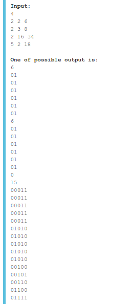
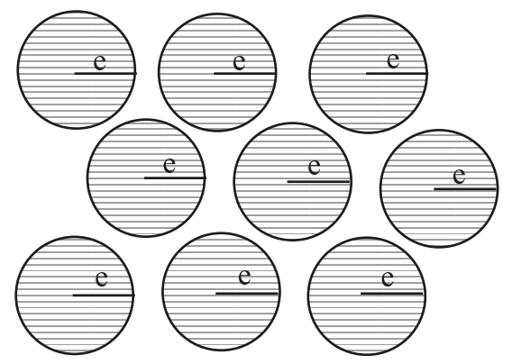

## Abstrak - Pengembangan Algoritma Pencarian Non Interaktif untuk Penyelesaian Permasalahan Pencarian Ulam dengan Kebohongan Jamak

Dalam perkembangan dunia teknologi informasi selama beberapa dekade terakhir, teknologi informasi seringkali dijadikan solusi bagi permasalahan-permasalahan yang pernah ada, yang sebelumnya diselesaikan secara manual oleh manusia. Contoh permasalahan yang pernah ada adalah salah satu permasalahan klasik pencarian Rényi–Berlekamp–Ulam, atau dapat disingkat menjadi RBU. Permasalahan ini dapat diilustrasikan dengan adanya dua pemain yang disebut penanya dan penjawab.

Sudah ada beberapa variasi pada permasalahan RBU. Pelc menyelesaikan permasalahan RBU dengan _query_ rentang [a,b] dan dengan maksimal jumlah bohong adalah satu. Mundici et all dan Min et all menyelesaikan permasalahan RBU dengan _query_ rentang [a,b] dan dengan maksimal jumlah bohong dua. Ahlswede mengilustrasikan permasalah RBU dengan maksimal bobot bohong adalah e dengan _graph_ _bipartite_.

Salah satu variasi permasalahan RBU yang diangkat dalam penelitian ini adalah pencarian Ulam dengan m _query_ _subset_ Qi={q1,q2,...,qj} dimana qj ∈ Sn, maksimal bohong adalah e, dan penjawab hanya boleh menjawab _query_ penanya setelah penanya selesai menanyakan semua _query_-nya. Permasalahan ini dapat diselesaikan dengan pencarian biner non-interaktif.

## Abstract - Development of Non-Interactive Searching Algorithm for Solving Ulam's Searching Problem with Many Lies

In the development of the world of information technology over the last few decades, information technology is often used as a solution to the problems that ever existed, which was previously solved manually by humans. Example of problems that ever existed were one of the classic problems, Rényi-Berlekamp-Ulam searching game, abbreviated by RBU. This problem can be illustrated by the presence of two players called asker and responder.

There have been several variations on RBU issues. Pelc solved the RBU problem with query range [a, b] and with a maximum number of lies is one. Mundici et all and Min et all solved the RBU problem with query range [a, b] and with a maximum of two lies. Ahlswede illustrated the RBU problem with maximum lie weight is e with bipartite graph.

One of the RBU problem variations raised in this research is the RBU search with m query subset Qi = {q1, q2, ..., qh} where qj ∈ Sn, max lie is e, and responder can only answer all queries after the asker has finished asking all queries. This problem can be solved by non-interactive binary search.

## Background

Dalam perkembangan dunia teknologi informasi selama beberapa dekade terakhir, teknologi informasi seringkali dijadikan solusi bagi permasalahan-permasalahan yang pernah ada, yang sebelumnya diselesaikan secara manual oleh manusia. Contoh permasalahan yang pernah ada adalah salah satu permasalahan klasik pencarian Rényi–Berlekamp–Ulam, atau dapat disingkat menjadi RBU. Permasalahan ini dapat diilustrasikan dengan adanya dua pemain yang disebut penanya dan penjawab. Diberikan range pertanyaan `Sm = {1,2,...,n}`. Penjawab menentukan sebuah bilangan `x ∈ Sn`. Penanya harus menemukan nilai `x` dengan memberikan beberapa _query_ khusus apakah "`x ∈ Q?`", dimana `Q` adalah _subset_ dari `Sn`, lalu penjawab menjawab "ya" atau "tidak". Permasalahan utama adalah penjawab dapat berbohong sampai `e` kali. Tujuan dari RBU adalah mencari jumlah _query_ minimal untuk dapat menentukan nilai `x`. 

<!-- Permasalahan ini adalah turunan dari kerangka kerja pencarian adaptif biner **Need citation**. -->

Sudah ada beberapa variasi pada permasalahan RBU. Pelc (1987) menyelesaikan permasalahan RBU dengan _query_ rentang [a,b] dan dengan maksimal jumlah bohong adalah satu. Mundici et all (1997) dan Min et all (2016) menyelesaikan permasalahan RBU dengan _query_ rentang [a,b] dan dengan maksimal jumlah bohong dua. Ahlswede (2008) mengilustrasikan permasalah RBU dengan maksimal bobot bohong adalah e, dengan menggunakan _bipartite graph_ untuk menyimpan kanal kebohongan dan memberikan batasan asimtotik yang ketat untuk jumlah _query_ yang dibutuhkan untuk memecahkan masalah ini.

Salah satu variasi permasalahan RBU yang diangkat dalam penelitian ini adalah pencarian Ulam dengan `m` _query_ _subset_ `{q1,q2,...,qm} | qj ∈ Sn`, maksimal bohong adalah `e`, dan penjawab hanya boleh menjawab _query_ penanya setelah penanya selesai menanyakan semua _query_-nya. Belum ada penelitian yang menyelesaikan permasalahan ini. Oleh karena itu penelitian ini bertujuan untuk memberikan solusi pada permasalahan ini.

Penelitian tentang permasalahan Ulam selama ini hanya membahas tentang _query_ yang interaktif dari penanya dan penjawab, baik dengan jumlah maksimal bohong satu, dua, tiga, dan lebih dari tiga. Namun belum ada jurnal ilmiah yang membahas permasalahan Ulam dengan _query_ non-interaktif dengan jumlah bohong lebih dari dua. Kontribusi dari penelitian ini adalah menggunakan metode pencarian biner non-interaktif untuk menyelesaikan permasalahan Ulam.

## Batasan masalah

1. Implementasi algoritma menggunakan bahasa pemrograman C++.
2. Batas maksimum kasus uji adalah 2^7.
3. Interval bilangan yang yang dicari berada pada [1,n], dengan n maksimum 2^12.
4. Dataset yang digunakan adalah dataset pada permasalahan SPOJ GUESSN5.

## Related work

_-- belum dirumuskan --_

## Problem formulation

Penjawab menentukan sebuah bilangan x pada rentang Sn=[1,n]. Penanya harus mencari nilai x dengan memberikan maksimal m _query_ khusus apakah "`x ∈ Q?`", lalu penjawab menjawab "ya" atau "tidak" pada setiap _query_ yang ditanyakan. Permasalahan utama adalah penjawab dapat berbohong sampai e kali. Selain itu, penjawab hanya boleh menjawab _query_ penanya setelah penanya selesai menanyakan semua _query_-nya. Tujuan dari RBU adalah mencari jumlah _query_ minimal untuk dapat menentukan nilai x.

Bentuk dari _query_ adalah string `s1s2s3...sn` dimana si bernilai '0' atau '1'. Jawaban dari penjawab adalah "Ya" jika `sx='1'` atau "Tidak" jika `sx='0'` dengan asumsi penjawab menjawab jujur.

Tugas sesungguhnya dari permasalahan ini adalah bukan untuk mencari nilai `x`, tapi hanya menyiapkan _query_ yang dapat memeungkinkan untuk mendapatkan nilai `x` dari semua kemungkinan jawaban dari penjawab. Penjawab tidak akan menjawab _query_ yang diberikan penanya. Jika penjawab menemukan ada suatu set jawaban yang menyebabkan lebih dari satu kemungkinan nilai `x`, maka pengujian dianggap gagal.

> **Gambar 1** Contoh uji kasus permasalahan

**Gambar 1** adalah contoh empat uji kasus dari permasalahan SPOJ GUESSN5. Pada uji kasus yang pertama hanya terdapat dua angka. Penjawab dapat menjawab "YYYYYY" atau "NNNNNN" jika penjawab tidak berbohong. Penjawab dapat menjawab "YYYYYN", "YYYYNY", "YYYNYY", "YYNYYY", "YNYYYY", "NYYYYY", "NNNNNY", "NNNNYN", "NNNYNN", "NNYNNN", "NYNNNN", atau "YNNNNN" jika penjawab berbohong satu kali. Penjawab dapat menjawab "NNNNYY", "NNNYNY", "NNNYYN", "NNYNNY", "NNYNYN", "NNYYNN", "NYNNNY", "NYNNYN", "NYNYNN", "NYYNNN", "YNNNNY", "YNNNYN", "YNNYNN", "YNYNNN", "YYNNNN", "NNYYYY", "NYNYYY", "NYYNYY", "NYYYNY", "NYYYYN", "YNNYYY", "YNYNYY", "YNYYNY", "YNYYYN", "YYNNYY", "YYNYNY", "YYNYYN", "YYYNNY", "YYYNYN", atau "YYYYNN" jika penjawab berbohong dua kali. Kemungkinan jawaban selain tersebut di atas tidak mungkin karena penjawab akan berbohong tiga kali.

Pada uji kasus yang kedua penjawab mencoba memberikan solusi namun jawabannya salah. Penanya dapat menjawab "YYYNNN" yaitu jawaban yang valid karena jumlah bohong tiga kali untuk kedua kemungkinan angka. Pada kasus ini, penanya membutuhkan _query_ tambahan.

Pada uji kasus yang ketiga penanya tidak memberikan solusi.

Pada uji kasus yang keempat penanya memberikan _query_ yang lebih sedikit dari jumlah _query_ maksimal yang diperbolehkan. Dari semua kemungkinan jawaban penjawab, pasti hanya ada satu jawaban nilai x, jadi solusi penanya berhasil.

## Backround from coding theory

Tujuan utama dari teori pengkodean (_coding theory_) adalah bagaimana mengirimkan pesan pada kanal yang mengandung derau (_noisy channel_) **[1]**. Misal jika ada delapan macam kata pesan yang akan dikirim, maka kita akan merepresentasikan pesan tersebut menjadi bitstring dengan panjang 3. Namun jika pesan tersebut dikirm langsung melewati kanal yang mengandung derau, bisa jadi misalkan ada 1 bit akan tertukar, misal `001` menjadi `011`. Jika terjadi seperti itu, maka sebuah kata dapat tertukar menjadi kata yang lain.

Kita tahu bahwa jika kode biner sepanjang `n` digunakan untuk membuat `2^n` bitstring tidak akan dapat mendeteksi eror. Ide yang paling mungkin adalah pengirim dan penerima menyetujui sebuah metode enkripsi bitstring menjadi bitstring yang lebih panjang dan dapat mendeteksi maksimal sebanyak `e` error.

Jarak Hamming dari bitstring `x` dan `y` dengan panjang `n` didefinisikan dengan `dH(x,y) = |{i∈{1,...,n} | xi≠yi}|` **[2]**. Sebagai contohnya `dH(0000,1111)= 4` dan `dH(00110,00101)= 2`. `dH(x,y)` juga dapat dikatakan jumlah minimal untuk mentransformasi dari `x` ke `y`. Contoh `x=00110` dan `y=00101` memiliki perbedaan pada 2 bit terakhir dengan jarak Hamming 2, dapat dikatakan `x+00011 = y`.

Bobot dari bitstring `x` didefinisikan dengan `wt(x)`, yaitu jumlah digit pada `x` yang bukan `0`. Sebagai contohnya, `wt(00101) = 2` dan `wt(11111) = 5`. Jika dihubungkan dengan jarak Hamming, jika `x+e = y` maka `dH(x,y) = wt(x+y)`.

Terdapat sebuah sifat pada jarak Hamming yang bernama segitiga pertidaksamaan (_triangle inequality_), yaitu `dH(x,y) <= dH(x,z) + dH(y,z)` untuk semua `x`, `y`, dan `z`. Dari segitiga pertidaksamaan tersebut, misalkan `z` adalah string biner yang berisi semua `0`, maka didapatkan `dH(x,y) <= wt(x) + wt(y)`.

<!-- Terdapat beberapa sifat-sifat dari jarak Hamming.

 > `dH(x,y) >= 0` untuk semua `x` dan `y`  
 > `dH(x,y) = dH(y,x)` untuk semua `x` dan `y`  
 > `dH(x,y) = 0` jika dan hanya jika `x=y`  
 > `dH(x,z) <= dH(x,y) + dH(y,z)` untuk semua `x`, `y`, dan `z`   -->

Kode biner (_binary code_) adalah sejumlah `M` bitstring biner dengan panjang masing-masing bitstring adalah `n` dan jarak Hamming pada masing masing bitstring adalah `d`. Mari kita ambil contoh `M=8`, `n=6`, dan `d=3` pada **Kode sumber 1**. Parameter pada kode ini adalah `(6,8,3)2`, yaitu kode biner yang ditunjukkan pada angka 2, panjang bitstring 6, berisi 8 bitstring, dengan jarak Hamming minimal 3. Bitstring pada kode biner selanjutnya disebut kata kode (_codeword_).

> `000000 100110`  
> `001011 101101`  
> `010101 110011`  
> `011110 111000`.

> **Kode sumber 1** Kode biner `(6,8,3)2`.

Dengan kode biner `(6,8,3)2`, pengirim dan penerima menyepakati hanya kata kode yang akan dikirim dan diterima. Dengan asumsi hanya ada satu bit yang dapat error, pesan error tetap dapat dikembalikan ke bentuk semula. Misal `111100` akan menjadi `111000`, `000011` akan menjadi `001011`, dan seterusnya. Jarak Hamming antara setiap dua kata kode yang berbeda adalah 3, berarti dari setiap kata kode, terdapat sejumlah bitstring selain kata kode berjarak 1.

> **Gambar 2** bola codeword yang tidak saling overlap

Notasi umum kode biner adalah `(n,M,d)2`. Kita bisa asumsikan ada `M` bola yang tidak saling bersinggungan atau berpotongan, dengan radius bola `e=(d-1)/2` seperti pada **Gambar 2**. Dari ilustrasi bola-bola tersebut dapat disimpulkan bahwa jika dikirimkan sebuah kata kode, bitstring setelah terjadi maksimal `e` pertukaran bit, hasil akan tetap hanya dekat dengan satu kata kode saja. **Duh intinya aku pingin ngasih  tau kenapa kok `d=2*e+1`. Apa sudah cukup ya?**

## Solusi permainan Ulam non-interaktif

Diberikan sebuah matriks `L` berukuran `nxM` berisi `n` query `Q={q1,q2,...,qn} | qi={s1,s2,...,sM} | si={0,1}`. Diberikan sebuah vektor `z = {z1,z2,...,zn} | zi={0,1}` berisi jawaban dari seluruh query secara berurutan, `zi` adalah jawaban dari `qi`, dimana `0` berarti 'tidak' dan `1` berarti 'ya'. Karena jika jawaban `0` berarti query harus ditambah dengan 1 dan jika jawaban `1` berarti query ditambah dengan 0 (diabaikan), maka kita memiliki `z'` yaitu inverse dari `z`. 

Matriks `L'` berukuran `Mxn` adalah hasil transpose dari matriks `L`. Tambahkan seluruh baris pada `L'` dengan `z'`. Maka jawaban dari permainan Ulam non-interaktif adalah index dari baris `r` pada `L'` yang memiliki bobot `wt(r) > n-e`.

Penanya memenangkan permainan jika `L'` memiliki paling banyak satu row dengan `wt(x) >= n-e`. Jika hanya ada satu row, maka row tersebut adalah jawaban permainan. Jika tidak ada satu row pun yang memenuhi, penanya tetap memenangkan permainan karena penjawab melakukan kecurangan, melakukan bohong untuk semua angka lebih dari batas yang ditetapkan.

Untuk meyakinkan bahwa setelah seluruh jawaban `z` diberikan dan diaplikasikan ke matrix `L` dan tidak pasti hanya ada 1 baris yang memiliki nilai `1` antara `n-e <= wt(r) <= n`, adalah dengan memastikan bahwa jarak Hamming setiap row yang berbeda pada `L'` adalah minimal `2*e+1`.

 > Diketahui integer n, M, dan d. Buktikan bahwa jika `L'` adalah kode biner `(n,M,d)2` yang valid, maka pasti hanya ada paling banyak satu codeword c yang memiliki `0 <= wt(c) <= e`.  
 > **(1) Jika `wt(c) = 0`**  
 > maka `dH(c,xi) >= d | c != xi | xi ∈ L'`  
 > `wt(c + xi) >= d`  
 > `wt(xi) >= d`  
 > **(2) Jika `wt(c) = e`**  
 > maka `dH(c,xi) >= d | c != xi | xi ∈ L'`  
 > `wt(c+xi) >= d`  
 > `wt(c) + wt(xi) >= wt(c+xi) >= d`  
 > `wt(c) + wt(xi) >= d`  
 > `e + wt(xi) >= d`  
 > `wt(xi) >= d - (d-1)/2`  
 > `wt(xi) >= (d+1)/2`  
 > **::** `wt(xi) > e` jika ada codeword `c | 0 <= wt(c) <= e`

Dari pembuktian diatas, dapat disimpulkan bahwa untuk menyelesaikan permainan pencarian Ulam non-interaktif dengan batas pencarian `M` dan maksimal kebohongan `e`, transpose dari `n` query yang dibuat harus membentuk kode biner `(n,M,d)2`.

 > Diketahui integer n, M, dan d. Buktikan bahwa jika `L'` adalah kode biner `(n,M,d)2` yang valid, maka jika setiap codeword c pada `L'` ditambah dengan `z | z ∈ F(2,n)` maka hasilnya akan tetap menjadi kode biner `(n,M,d)2` yang valid.  
 > Buktikan bahwa jika  
 > `dH(xi,yi) >= d | i!=j | xi,yi ∈ L'`  
 > maka  
 > `dH(xi+z,yi+z) >= d`  
 > `wt(xi+yi+zi+zi) >= d`  
 > `wt(xi+yi) >= d`  
 > `dH(xi,yi) >= d`  
 > **::** `dH(xi+z,yi+z) >= d` jika `dH(xi,yi) >= d`

## Pengujian _(apakah penting?)_

Tahap pengujian adalah melakukan uji coba menggunakan dataset pada Online Judge SPOJ GUESSN5 untuk mengetahui hasil dan performa dari metode dan struktur data yang dibangun. Hal yang dinilai pada pengujian adalah skor, penggunaan memory, dan waktu yang dibutuhkan. Pembobotan skor adalah jika penjawab menemukan ada suatu set jawaban yang menyebabkan lebih dari satu kemungkinan nilai `x`, maka pengujian dianggap gagal. Jika berhasil, maka nilai skor bertambah `q^2`. Jika gagal, maka nilai skor bertambah `4m^2`. Total skor adalah jumlah skor setiap kasus uji.

Evaluasi dan perbaikan juga akan dilakukan pada Online Judge hingga perangkat lunak yang diuji mengeluarkan hasil dan performa yang sesuai dengan data uji pada Online Judge SPOJ.

### References

1. [Introduction to coding theory](drive.google.com)
2. [Perfect two-fault tolerant with minimum adaptiveness](drive.google.com)